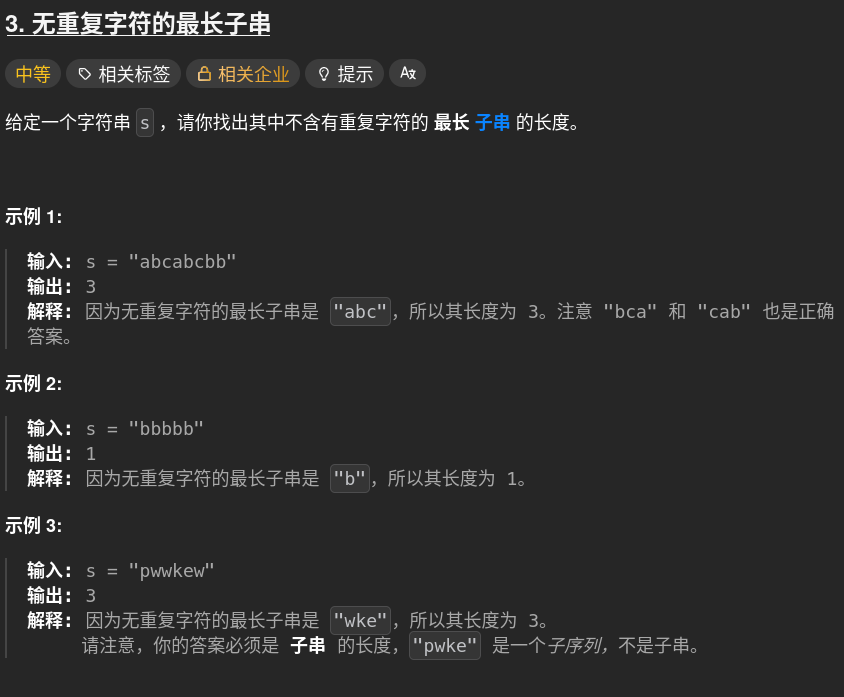

# 3. lengthOfLongestSubstring 🚀

## 题目描述 📄


---

## 思路 💡
hashtable存放对应遍历字符作为key，value无关，发现key存在时计数器停止，长度变量取max。遍历结束后return max

**第一次的错误：ex:“pkewdp",遇到p时选择了清空计数器，清空字典，会漏”kewdp这一段。**
### :white_check_mark:正解：动态维护一个左边界作为起点,重复时且重复位置在起点标记之后，更新起点标记到重复位置的下一位
### :star:窗口左边界，子串长度就是窗口长度
---

## 算法复杂度 ⏱

| 类型 | 复杂度 |
|------|--------|
| 时间复杂度 |n |
| 空间复杂度 | |

---

## 代码 💻

```python
# 写你的代码
```

---

## 测试用例 🧪


---

## 总结 📚

