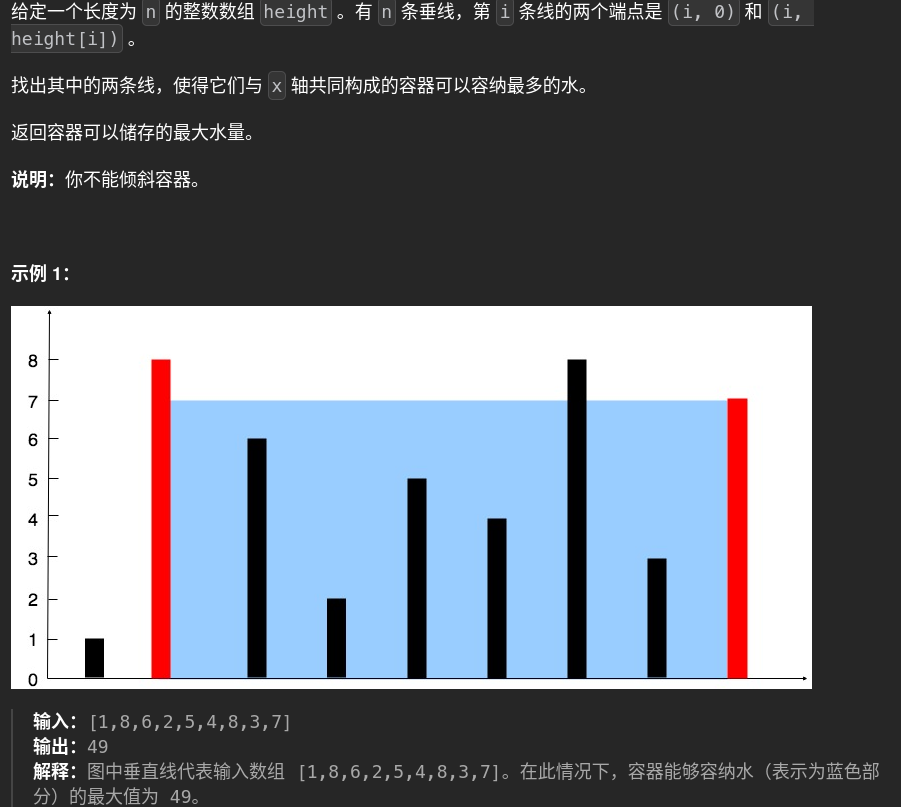

# 11. maxArea 🚀

## 题目描述 📄


---

## 思路 💡
面积：k-i * min(height[i],height[k])
解法1：暴力算：

        maxOne=0
        for i in range(len(height)-1):
            for j in range(i+1,len(height)):
                area=(j-i)*min(height[i],height[j])
                maxOne=max(maxOne,area)
        return maxOne

---
第一次改进：
先取出最高和第二高，得到宽度和面积，然后以这个为新间距起点
:x:太复杂,跑偏了

正解思路：双指针两边夹，逐步收缩，每次只移动矮边的指针，两指针相遇则结束

	maxarea=0
	left=len(height)-1#left表示的是末尾下标，要-1
	# for right in range(0,left): ##python for循环不会动态改变终点
	# 	candidateArea=min(height[right],height[left])*(left-right)
	# 	if height[right]<height[left]:
	# 		maxarea=max(maxarea,candidateArea)
	# 		continue
	# 	else:
	# 		maxarea=max(maxarea,candidateArea)
	# 		left-=1
	# 		continue
	return maxarea
#### 几个错误点：长度和下标关系，pythonFor循环不会动态修正终点，所以这里用while

## 算法复杂度 ⏱

| 类型 | 复杂度 |
|------|--------|
| 时间复杂度 |n |
| 空间复杂度 | |

---

## 代码 💻

```python
# 写你的代码
```

---

## 测试用例 🧪


---

## 总结 📚

