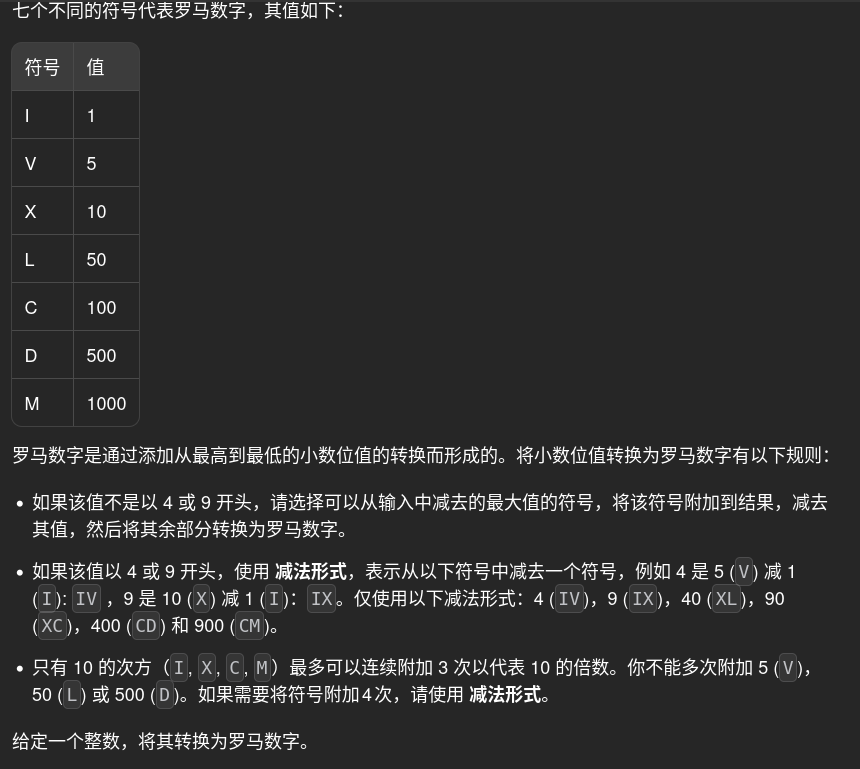

# 12. romanToInt 🚀

## 题目描述 📄


---

## 思路 💡
列大表（内存换时间）[所有的位数key和字母表示，列成千百十个四组字符串列表]
贪心哈希：（同样要把4,9的情况直接组合到表中，方便计算

---

## 算法复杂度 ⏱

| 类型 | 复杂度 |
|------|--------|
| 时间复杂度 | |
| 空间复杂度 | |

---

## 代码 💻

```python
# 写你的代码
```

---

## 测试用例 🧪


---

## 总结 📚

