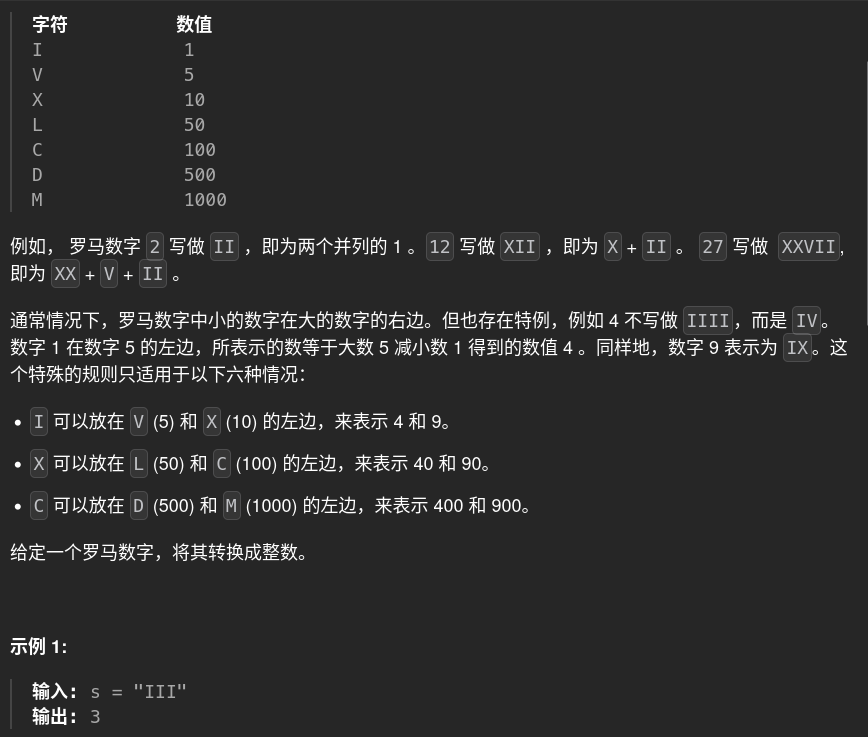

# 13. romanToInt 🚀

## 题目描述 📄


---

## 思路 💡
先整一个字典
判断字符是否小于后一个字符，小的话用-，否则就正常加
---

## 算法复杂度 ⏱

| 类型 | 复杂度 |
|------|--------|
| 时间复杂度 | |
| 空间复杂度 | |

---

## 代码 💻

```python
# 写你的代码
```

---

## 测试用例 🧪


---

## 总结 📚

