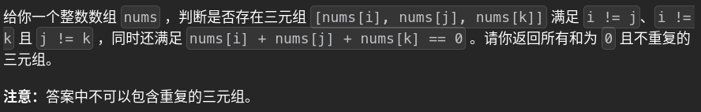

# 15. threeSum 🚀

## 题目描述 📄


---

## 思路 💡
固定一个，剩下的做二数和——>n^2 复杂度:x:遇到了去重问题

---

## 算法复杂度 ⏱

| 类型 | 复杂度 |
|------|--------|
| 时间复杂度 | |
| 空间复杂度 | |

---

## 代码 💻

```python
# 写你的代码
```

---

## 测试用例 🧪


---

## 总结 📚

