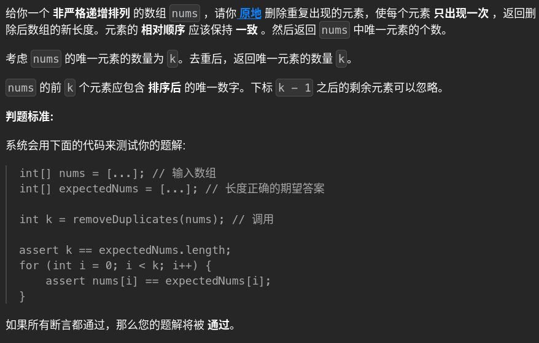

# 26. removeDuplicates 🚀

## 题目描述 📄


---

## 思路 💡
### 快慢指针：
快指针：遍历全部元素
慢指针：维护或记录非重复元素

        setnumbers=set()
        k=0
        for i in range(len(nums)):
            if nums[i] not in setnumbers:
                setnumbers.add(nums[i])
                nums[k]=nums[i]
                k+=1
            else:
                continue
        return k

---
### 可优化方向：
我用了set来记录已经出现的重复元素，但题目已经说了是有序数组，所以其实可以用前后元素是否相同来判断，我使用set()牺牲了空间复杂度O(n)
如果是无序，就需要像我现在这么做
## 算法复杂度 ⏱

| 类型 | 复杂度 |
|------|--------|
| 时间复杂度 | n|
| 空间复杂度 | n|

---

## 代码 💻

```python
# 写你的代码
```

---

## 测试用例 🧪


---

## 总结 📚

