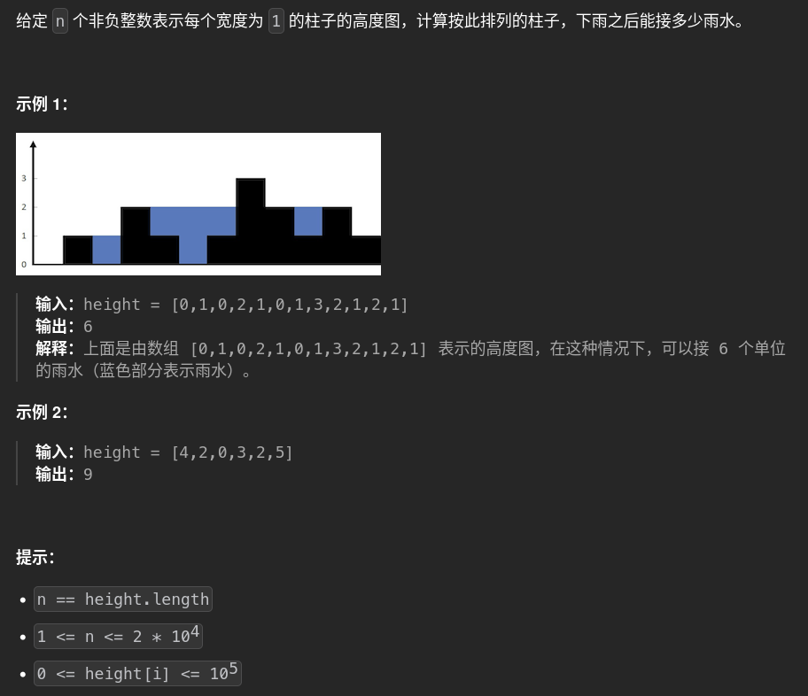

# 42. trap_jieyushui 🚀

## 题目描述 📄



---

## 思路 💡
### 初见思路，先找局部最小值，再左右指针向外扩找到局部最大值，局部最大值之间比较出较小值，较小值高×间距-区间内的既有值（比较小值矮按本值算，比较小值高按较小值计算扣减）
:x: 4,2,0,3,2,5
###漏解，整体拆成局部之后漏解了。代码写的没问题，思路问题


    def trap(height: list[int]) -> int:
        res=0
        for i in range(1,len(height)-1):
            left=i-1
            right=i+1
            if height[i]>height[left] or height[i]>=height[right]: 
                #跳过i:1\大于任意左右一边，2\等于右边就跳
                continue
            
            leftend=False
            rightend=False
            # if left<0:continue
            # if right>=len(height):break
            while not leftend:
                if left-1<0 or height[left]>height[left-1]:
                    leftend=True
                    break
                left-=1
            while not rightend:
                if right==len(height)-1 or height[right]>height[right+1]:
                    rightend=True
                    break
                right+=1
            #边界等于底边情况筛选：
            if height[left]==height[i] or height[right]==height[i]:
                continue
            #左右边界比较
            thresh=min(height[left],height[right])
            width=right-left-1
            area=thresh*width
            for n in range(left+1,right):
                if height[n]>=thresh:
                    area-=thresh
                else:
                    area-=height[n]
            res+=area
        return res
---
### :white_check_mark: 正解思路：按列算，每一列的水量等于左右最高的墙中的次高者减去当列i墙高度，暴力解时间复杂度n^2
#### leftmax跟随i动态维护，rightmax记录并更新
二改

	res=0
	leftMax=0
	rightMax=0
	rightMaxIndice=0
	for i in range(len(height)):
		leftMax=max(leftMax,height[i])#左最高跟随i维护即可
		if rightMax==0 or i>=rightMaxIndice:#初始化rightMax以及更新rightMax
			rightMax=0
			for j in range(i+1,len(height)):
				
				rightMax=max(rightMax,height[j])
				if height[j]==rightMax:
					rightMaxIndice=j
		thresh=min(leftMax,rightMax)
		waterheight=thresh-height[i]
		if waterheight>=0:
			res=res+waterheight
	return res

#### :white_check_mark: 正解：左右指针向内滑动，O(n)
	res=0
	leftMax=0
	rightMax=0
	left=0
	right=len(height)-1
	while left<=right:
		
		if leftMax<rightMax:
			leftMax=max(leftMax,height[left])
			
			res+=leftMax-height[left]
			left+=1
			
		else: 
			rightMax=max(rightMax,height[right])
			
			res+=rightMax-height[right]
			right-=1
			
	return res

## 算法复杂度 ⏱

| 类型 | 复杂度 |
|------|--------|
| 时间复杂度 | |
| 空间复杂度 | |

---

## 代码 💻

```python
# 写你的代码
```

---

## 测试用例 🧪


---

## 总结 📚

