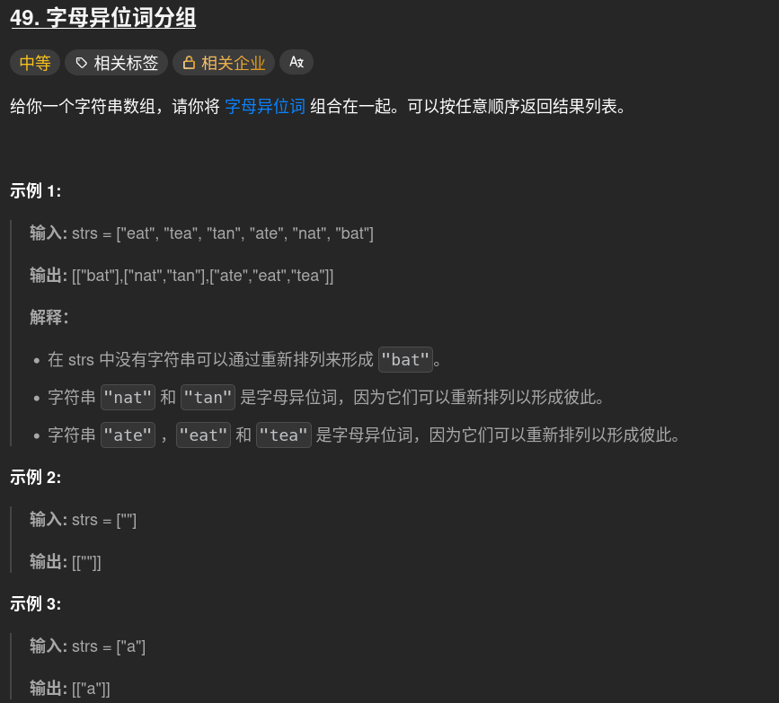

# 46 字母异位词分组问题
## 字母异味词--246
hash.get(key,default) 来统计字母出现次数

### 1、空字符串列表返回带有一个空字符串的列表的列表 :x:

### :white_check_mark: 正解：collection.defaultdict包依赖+用不变的唯一key:有序字符串;value 用列表来记录原来的字符串，最后用values()返回整个字典（记得list()）
#### 一种特殊的字典数据类型，当访问某个不存在的key时，会创建defaultdict(default)括号内的参数类型默认value即  defaultdict[key]->default
    常用工厂函数####
    int->0
    list-> []   set-> [{}]
**避免keyerror避免手动检查**
    if "key" not in dict:
        dict[key]=[]
 