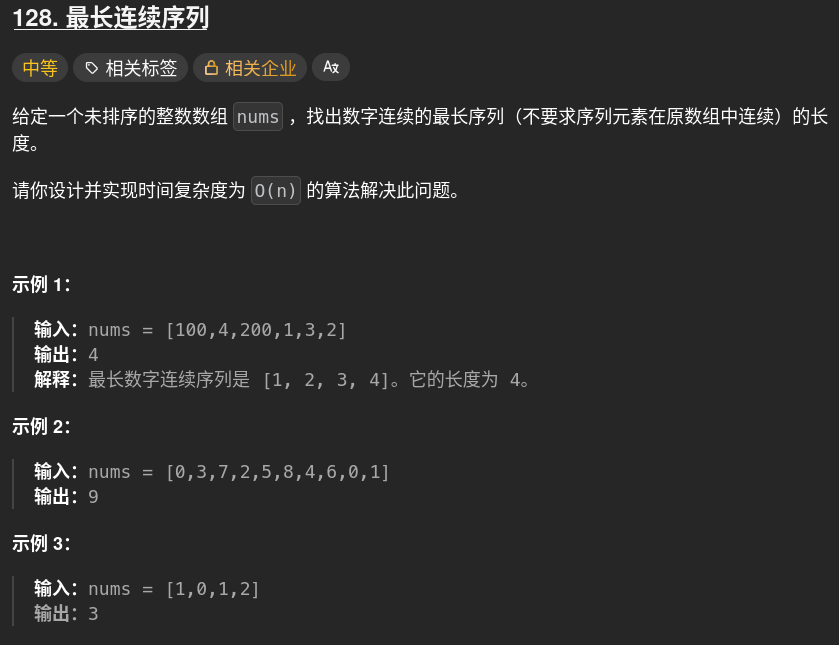

# 最长连续序列

散装思路：
set()去掉多余重复元素，要求O(n)，所以只能做一次遍历
遍历集合，如果x-1存在则当前x不能作为起点，"next x"用continue代替

    numset=set(nums)
    lengthlist=[]#计数器容器
    for x in numset:
        maxlength=1#计数器
        if x-1 in numset:
            next x
        for i in range len(numset):
            if x+1 in numset:
                x+=1
                maxlength+=1
                
