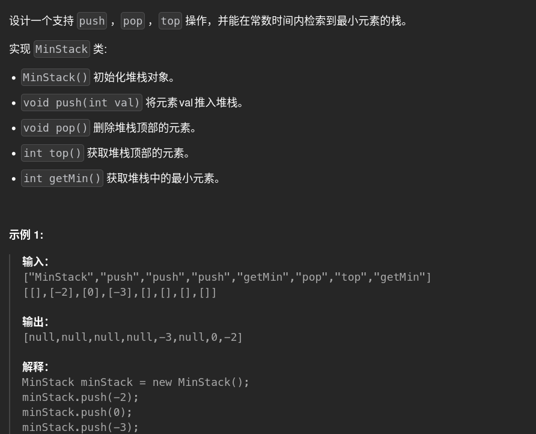

# 155. Minstack 🚀

## 题目描述 📄


---

## 思路 💡
输入：字符串列表：指令
二维列表：数据
输出
最小值问题：利用lifo特点，使用额外空间存储每个入栈时刻最小值，这样最小值跟随主值pop即可，getmin返回最小值栈顶
---

## 算法复杂度 ⏱

| 类型 | 复杂度 |
|------|--------|
| 时间复杂度 | |
| 空间复杂度 | |

---

## 代码 💻

```python
# 写你的代码
```

---

## 测试用例 🧪


---

## 总结 📚

