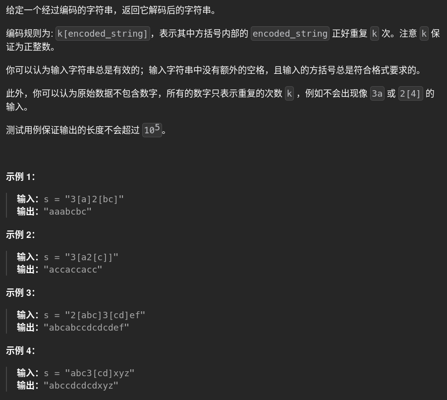

# 394. decodeString 🚀

## 题目描述 📄


---

## 思路 💡
#### 关键在于处理嵌套时用lifo的思想，[ 入栈  ] 出栈，栈内存储res和倍数的状态，每次出栈进行拼接
可以优化的点

    res = res + char
改成

    res_list = []
    res_list.append(char)
    "".join(res_list)

以及

    k, prev = statusStack.pop()#出栈pop本身带一次取值的操作
    res = prev + res * k
---

## 算法复杂度 ⏱

| 类型 | 复杂度 |
|------|--------|
| 时间复杂度 | |
| 空间复杂度 | |

---

## 代码 💻

```python
# 写你的代码
```

---

## 测试用例 🧪


---

## 总结 📚

