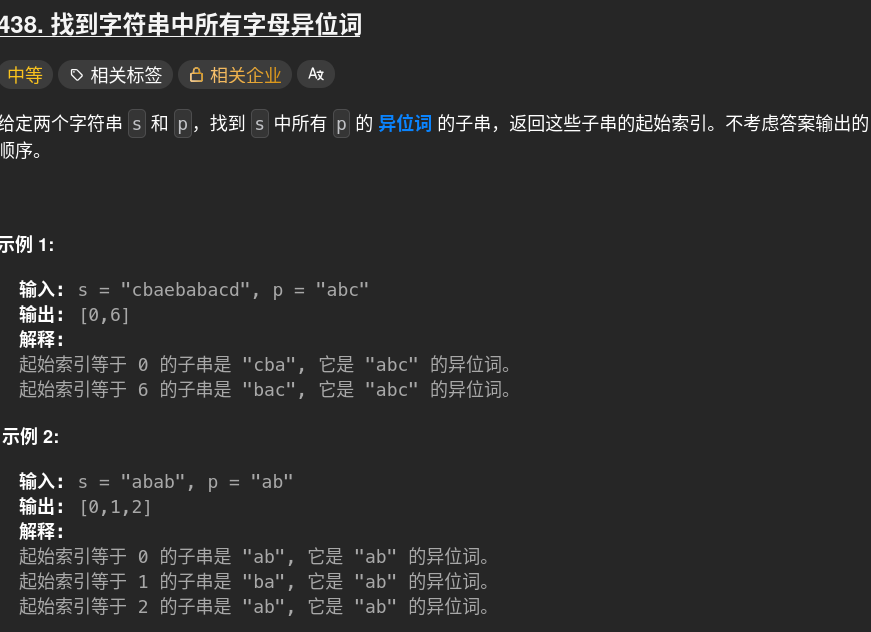

# 438. findAnagrams 🚀

## 题目描述 📄


---

## 思路 💡
1.暴力解：类似模板匹配一样去解

        def findAnagrams(s, p) :
            dictTemplate={}
            dictTarget={}
            slideLength =len(p)
            length=len(s)
            res=[]
            for x in p:
                dictTemplate[x]=dictTemplate.get(x,0)+1
            for i in range(0,length-slideLength+1):
                for t in range(slideLength):
                    dictTarget[s[i+t]]=dictTarget.get(s[i+t],0)+1
                if dictTarget==dictTemplate:
                    res.append(i)
                dictTarget.clear()
            return res
## 重新做窗口:x:耗时很大
## :white_check_mark:在上一次的窗口基础上-1,+1
    def findAnagrams(s, p) :
            dictTemplate={}
            dictTarget={}
            slideLength =len(p)
            length=len(s)
            res=[]
            for x in p:
                dictTemplate[x]=dictTemplate.get(x,0)+1
            start=0
            end=start+slideLength#indice+1实际indice+1
            if end < length:
                return[]
            if end == length:
                if sorted(p)==sorted(s):
                    return[0]
                else:
                    return[]
            while end<length:#匹配组比模板大的
                if start==0:#firstCheck
                    for i in range(start,end):
                        dictTarget[s[i]]=dictTarget.get(s[i],0)+1
                    if dictTarget==dictTemplate:
                        res.append(start)
                    #slide
                dictTarget[s[start]]=dictTarget.get(s[start])-1#头部删去
                if dictTarget.get(s[start],0)==0:
                    del dictTarget[s[start]]
                dictTarget[s[end]]=dictTarget.get(s[end],0)+1#尾部后1加入
                start+=1
                end+=1
                if dictTarget==dictTemplate:
                    res.append(start)
            return res

## Counter内置函数（collection）返回一个计数字典
---

## 算法复杂度 ⏱

| 类型 | 复杂度 |
|------|--------|
| 时间复杂度 | |
| 空间复杂度 | |

---

## 代码 💻

```python
# 写你的代码
```

---

## 测试用例 🧪


---

## 总结 📚

