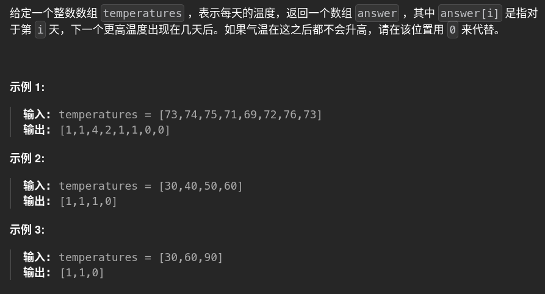

# 739. dailyTemperatures 🚀

## 题目描述 📄


---

## 思路 💡
自己的思路：对于数据，正向遍历，如果下一个比上一个大，则上一个取1,否则将上一个加入待定的辅助栈，存储值以及indice，接下来的元素与栈顶比较，如果出现大于栈顶则与对应indice相减，遍历结束对于还停留在栈内的元素结果置零
###单调栈法待优化
---

## 算法复杂度 ⏱

| 类型 | 复杂度 |
|------|--------|
| 时间复杂度 | |
| 空间复杂度 | |

---

## 代码 💻

```python
# 暴力
        #暴力算
        res=[]	
        flag=True
        zeroCheck=0
        temp=temperatures.copy()
      
        while flag:
            fin=temp.pop()
            if fin>temp[-1]:
                flag=False
            zeroCheck+=1

        for i in range(0,len(temperatures)-zeroCheck):
            for j in range(i+1,len(temperatures)):
                
                if temperatures[i]<temperatures[j]:
                    res.append(j-i)
                    break
                elif  temperatures[i]>=temperatures[j] and j==len(temperatures)-1:
                   
                    res.append(0)
        for m in range(zeroCheck):
            res.append(0)

        return res

```

---

## 测试用例 🧪


---

## 总结 📚

